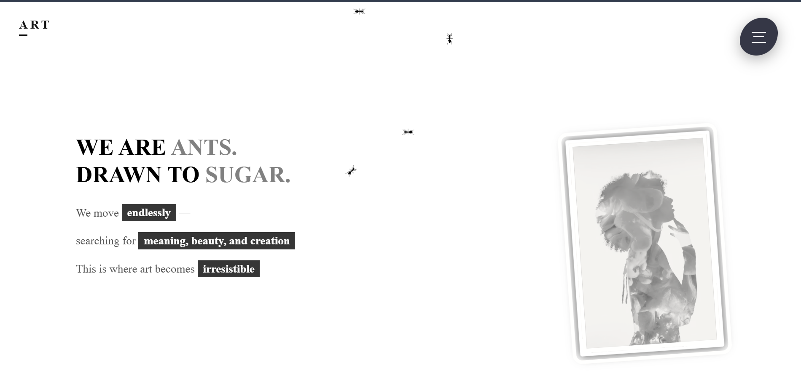
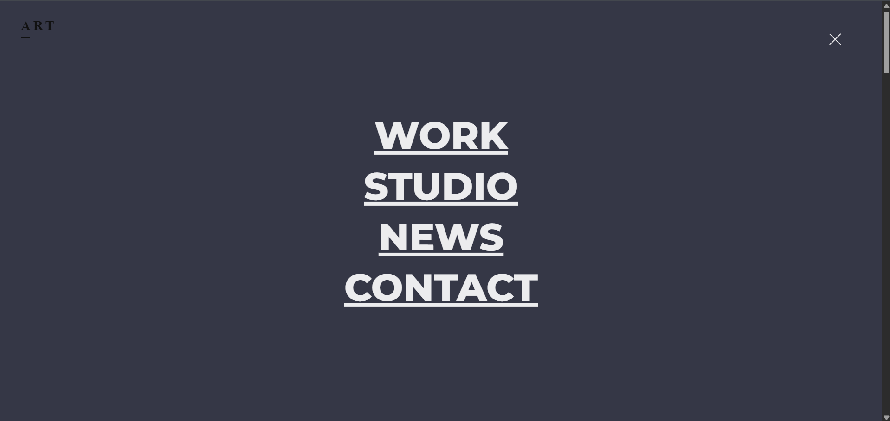
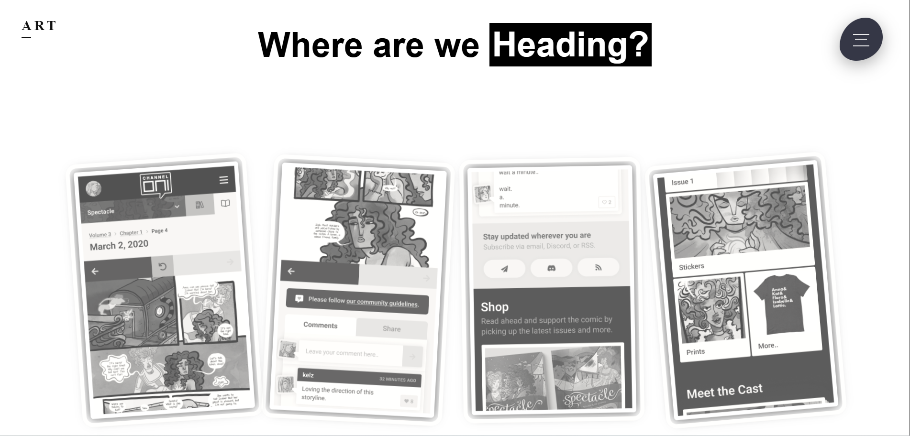
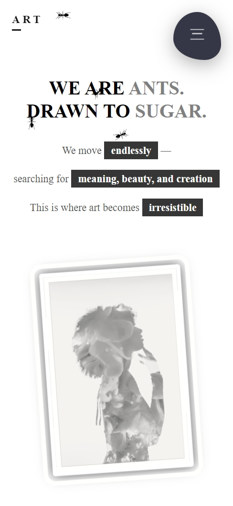
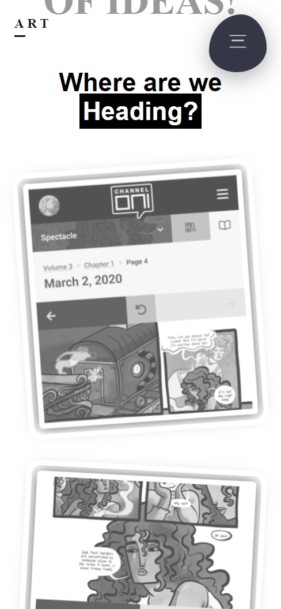
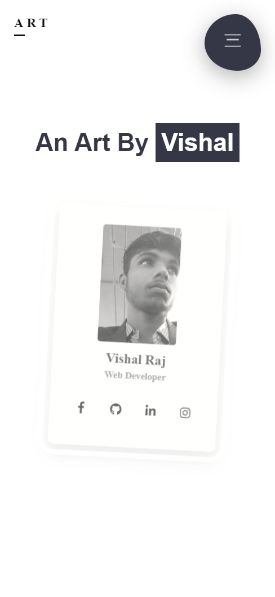

# 🎨 ART — A Creative CSS-Only Experience  
**Final Project | By Vishal Raj**

> *“We are ants, drawn to sugar.”*  
> This project explores how humans chase creativity, meaning, and ideas — expressed through **pure HTML & CSS**.

---

## 🚀 Live Experience

👉 https://vishalloop.github.io/html-css-playground/final_project/

---

## 🎥 Project Walkthrough (Desktop & Mobile)

> This screen recording showcases the complete experience — animations, interactions, responsiveness, and visual flow — across desktop and mobile views.

▶️ **[Watch the full screen recording](./videos/screenrecording.mp4)**  
*(Includes desktop & mobile experience)*

---

## 📸 Screenshots

### 🖥️ Desktop View

### 📱 Mobile View

---

## 🧠 About the Project

This is my **final and most ambitious HTML & CSS project**.

The goal was simple, but challenging:

> **Create a highly animated, immersive, story-driven website using only HTML and CSS — no JavaScript, no frameworks.**

This project blends:
- abstract storytelling
- experimental UI
- heavy CSS animations
- interaction-driven design
- responsive behavior across all devices

Every animation, transition, hover effect, and layout change is handled **entirely in CSS**.

---

## ✨ Key Highlights

### ⚙️ Built with **Pure CSS**
- No JavaScript
- No libraries
- No frameworks

### 🐜 Advanced CSS Animations
- SVG ant animations using `@keyframes`
- Multi-path movement without JS
- Background color transitions
- Text flipping animations
- Hover-driven transformations
- Layered card animations
- Animated hamburger navigation
- CSS-only menu morphing

### 🧩 Experimental UI Sections
- Story-driven hero section
- “Same Person, Different Personality” clip-path interaction
- Animated identity text loop
- Mobile-style card gallery with depth & focus
- CSS-only interactive profile card
- Social icons with hover animations

### 📱 Fully Responsive
- Desktop-first experience
- Tablet optimizations
- Mobile-specific layout and scaling
- Touch-friendly interactions
- Adaptive typography and spacing

---

## 🛠️ Tech Stack

- **HTML5**
- **CSS3**
- CSS Animations & Keyframes
- CSS Clip-path
- Flexbox & Responsive Media Queries
- Google Fonts
- Font Awesome Icons

---

## 📂 Project Structure

final_project/
│
├── index.html
├── index.css
│
├── images/
│ └── project assets & profile images
│
├── videos/
│ └── screenrecording.mp4
│
├── screenshots/
│ ├── desktop_1.png
│ ├── desktop_2.png
│ ├── desktop_3.png
│ ├── mobile_1.jpeg
│ ├── mobile_2.jpeg
│ └── mobile_3.jpeg
│
└── README.md

---

## 🧪 What This Project Demonstrates

- Deep understanding of **CSS animation systems**
- Strong control over **layout and visual hierarchy**
- Ability to build **complex interactions without JavaScript**
- Creative thinking beyond typical landing pages
- Attention to detail in motion and transitions
- Scalable, organized project structure

---

## 🧩 Challenges Solved

- Creating complex SVG animations using only CSS
- Managing performance with heavy animations
- Designing interactive navigation without JS
- Making animation-heavy layouts responsive
- Maintaining readability while experimenting visually

---

## 🚀 Future Improvements (Optional)

- Progressive enhancement with JavaScript
- Accessibility refinements (ARIA, contrast)
- Performance optimizations
- Convert sections into reusable components
- WebGL / Canvas experiments layered on top

---

## 👨‍💻 Author

**Vishal Raj**  
Frontend Developer • Creative Technologist  

> This project represents my growth, curiosity, and love for building things from scratch — pushing the limits of what CSS alone can do.

🔗 GitHub: https://github.com/vishalloop  
🔗 LinkedIn: https://linkedin.com/in/vishal-raj-b03511250  

---

⭐ If this project inspired you or made you curious, feel free to explore the repository and follow my journey.

