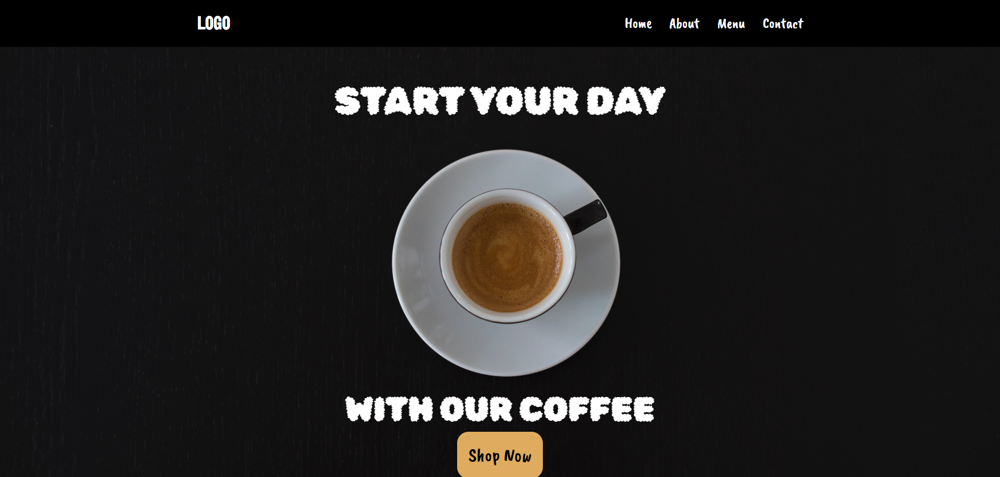
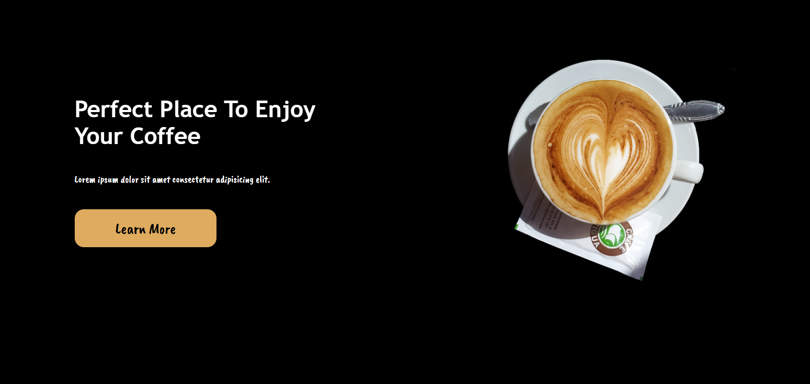
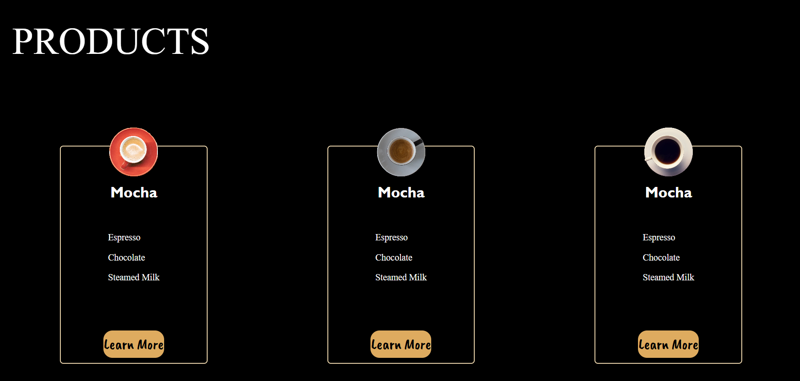
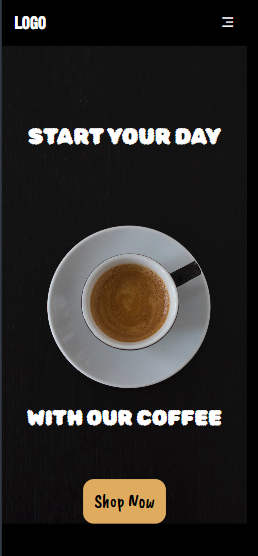
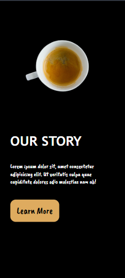

# ☕ Coffee Landing Page

A responsive coffee-themed landing page built using **pure HTML and CSS**.  
This project focuses on layout structure, responsiveness, and visual hierarchy without using any frameworks or JavaScript.

---

## 🎯 Purpose of This Project

This project was created to:
- Practice **real-world landing page layout**
- Improve **responsive design skills**
- Work with **background images, positioning, and cards**
- Understand **mobile-first adjustments using media queries**

This is part of my **HTML & CSS learning journey**, and more landing pages will be added in the future.

---

## 📸 Preview

### 🖥️ Desktop View

### 📱 Mobile View

---

## 🛠️ Tech Stack Used

- **HTML5**
- **CSS3**
- Google Fonts
- Remix Icon (for icons)

> No frameworks, no JavaScript — just core web fundamentals.

---

## 📂 Folder Structure

landing-page-01/
│
├── index.html
├── style.css
├── images/
│ ├── background.jpg
│ ├── 1.png
│ ├── 2.png
│ ├── 3.png
│ └── 4.png
└── README.md

yaml
Copy code

---

## ✨ Features

- ✅ Fully responsive (desktop, tablet, mobile)
- ✅ Hero section with background image
- ✅ Navigation bar with mobile menu icon
- ✅ “Our Story” & “Enjoy Coffee” sections
- ✅ Product cards with floating cup images
- ✅ Clean footer layout
- ✅ Custom fonts and color theme

---

## 📱 Responsiveness Details

- Mobile navigation menu icon appears below **600px**
- Layout adjusts using **media queries**
- Images and cards scale smoothly for smaller screens
- Flexbox used extensively for alignment and spacing

---

## 🧠 What I Learned

- Structuring a complete landing page from scratch
- Using `flexbox` for complex layouts
- Handling background images properly
- Absolute positioning for decorative elements
- Writing responsive CSS using multiple breakpoints
- Organizing a project for GitHub presentation

---

## 🚀 Future Improvements

- Add JavaScript for mobile menu interaction
- Improve accessibility (ARIA labels, contrast)
- Add smooth animations and hover effects
- Deploy using GitHub Pages
- Replace placeholder text with real content

---

## 👨‍💻 Author

**Vishal Raj**  
Frontend Developer (Learning in Public 🚀)

> This project is part of my HTML & CSS playground repository, where I document my growth through hands-on practice.

---

⭐ If you like this project, feel free to explore the repository and follow my journey.
