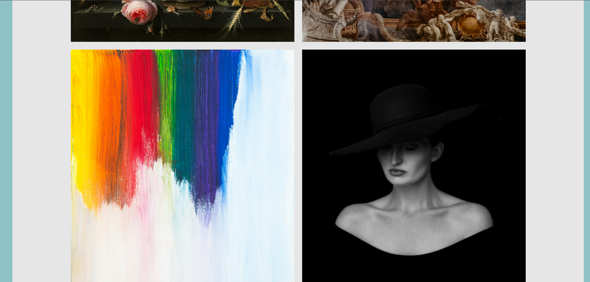
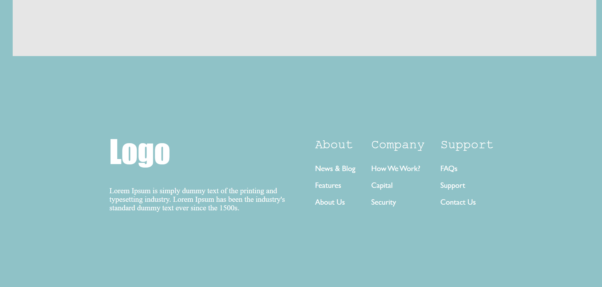
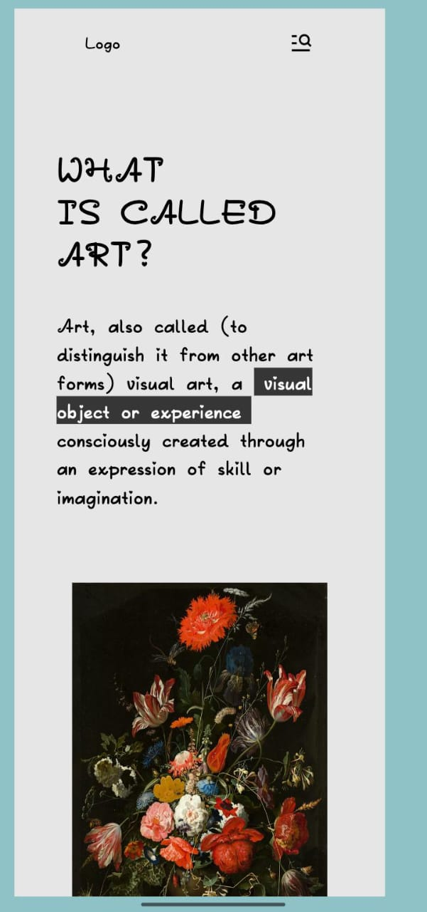
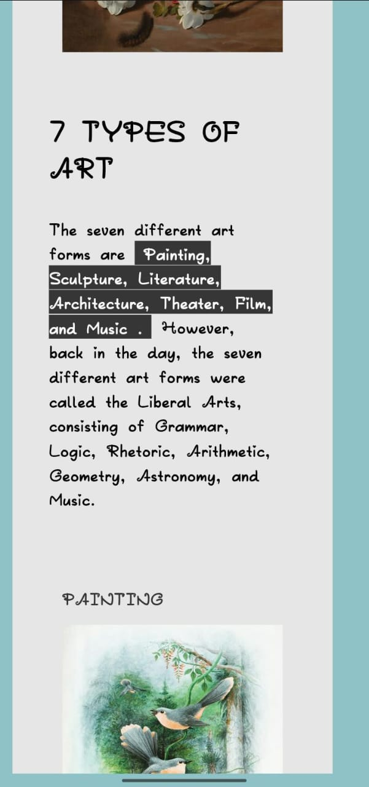
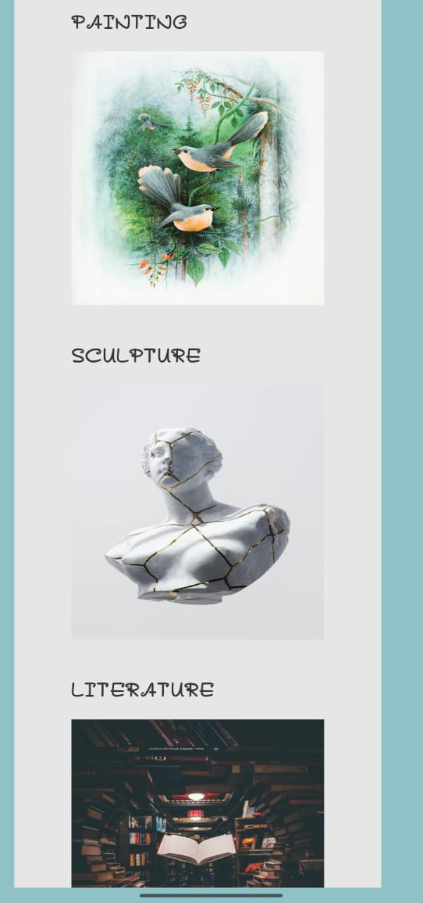

# 🎨 Art Landing Page

A visually rich and typography-focused landing page built using **pure HTML and CSS**, inspired by modern editorial and gallery-style layouts.

This project explores content-heavy layouts, large imagery, and clean visual hierarchy without using any frameworks or JavaScript.

---

## 🔗 Live Demo

👉 https://vishalloop.github.io/html-css-playground/landing-pages/landing-page-02/

*(Replace `your-username` with your GitHub username if needed)*

---

## 📸 Preview

### 🖥️ Desktop View

### 📱 Mobile View

---

## 🎯 Purpose of This Project

This landing page was created to:
- Practice **content-driven UI design**
- Work with **large images and typography**
- Improve **layout balance and spacing**
- Experiment with **editorial-style sections**
- Build responsive layouts without JavaScript

This project is part of my **HTML & CSS playground**, where I learn by building real UI designs.

---

## 🛠️ Tech Stack Used

- **HTML5**
- **CSS3**
- Google Fonts
- Remix Icons
- Unsplash images (for visual content)

> No frameworks, no JavaScript — focused purely on layout and styling fundamentals.

---

## ✨ Features

- ✅ Clean editorial-style hero section
- ✅ Large image gallery layout
- ✅ Informational content sections
- ✅ “7 Types of Art” listing with images
- ✅ Fully responsive for desktop, tablet, and mobile
- ✅ Minimal and elegant footer design
- ✅ Flexbox-based layout structure

---

## 📱 Responsiveness

- Layout adapts smoothly below **1000px** and **700px**
- Images scale proportionally on smaller screens
- Text size and spacing adjust for readability
- Mobile-friendly margins and paddings applied

---

## 📂 Folder Structure

landing-page-02/
│
├── index.html
├── style.css
├── screenshots/
│ ├── desktop_1.png
│ ├── desktop_2.png
│ ├── desktop_3.png
│ ├── mobile_1.jpeg
│ ├── mobile_2.jpeg
│ └── mobile_3.jpeg
└── README.md

yaml
Copy code

---

## 🧠 What I Learned

- Designing layouts with **content-first approach**
- Managing large images in responsive layouts
- Improving typography hierarchy
- Using Flexbox for complex multi-section pages
- Writing cleaner, scalable CSS
- Structuring frontend projects for GitHub

---

## 🚀 Possible Improvements

- Add subtle animations or transitions
- Improve accessibility (semantic tags, contrast)
- Optimize images for performance
- Add JavaScript-based interactions
- Convert this design into a React component

---

## 👨‍💻 Author

**Vishal Raj**  
Frontend Developer — learning by building 🚀

> This project is part of my HTML & CSS playground repository, documenting my growth through hands-on practice.

---

⭐ If you find this project interesting, feel free to explore the repository and follow my journey.