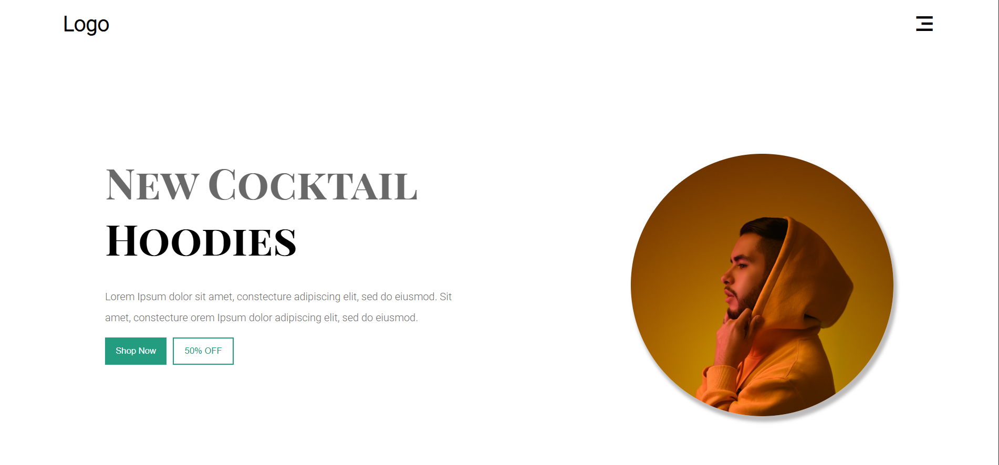
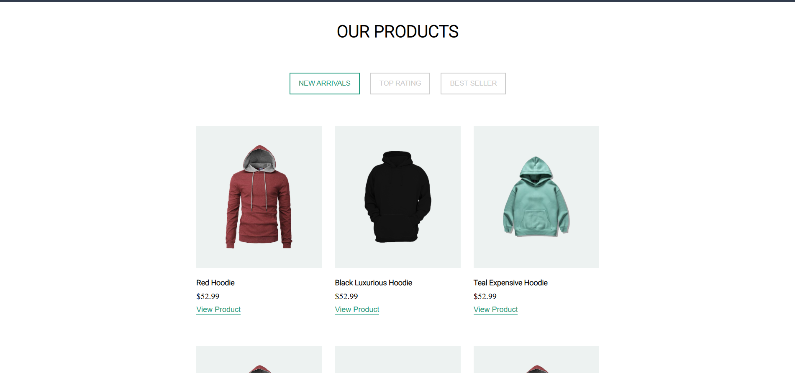
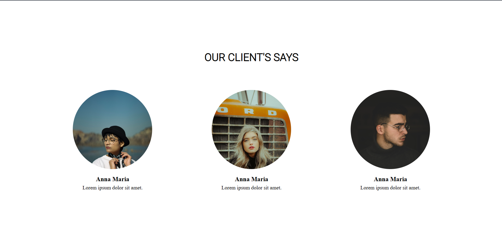
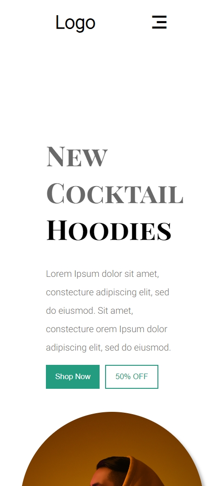
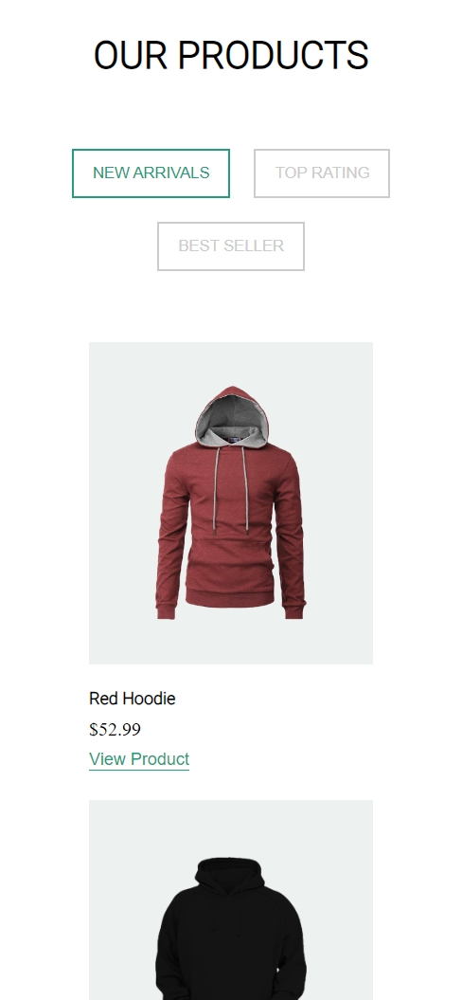
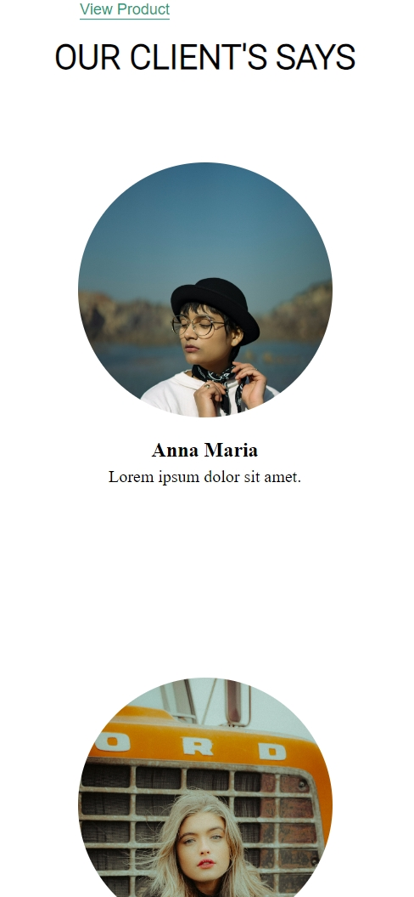

# 👕 Hoodie Landing Page

A modern, e-commerce–style landing page for a hoodie brand, built using **pure HTML and CSS**.  
This project focuses on layout structuring, product sections, call-to-actions, and responsive design without using any frameworks or JavaScript.

---

## 🔗 Live Demo

👉 https://your-username.github.io/html-css-playground/landing-pages/landing-page-03/

*(Replace `your-username` with your GitHub username)*

---

## 📸 Preview

### 🖥️ Desktop View

### 📱 Mobile View

---

## 🎯 Purpose of This Project

This landing page was created to:
- Practice **e-commerce UI layout design**
- Build product listing sections using HTML & CSS
- Improve **visual hierarchy and spacing**
- Work with **cards, buttons, and CTAs**
- Strengthen responsive layout skills using Flexbox

This project is part of my **HTML & CSS playground**, where I learn by building real-world UI designs.

---

## 🛠️ Tech Stack Used

- **HTML5**
- **CSS3**
- Google Fonts
- Remix Icons

> No JavaScript or frameworks — focused entirely on core frontend fundamentals.

---

## ✨ Features

- ✅ Clean hero section with call-to-action buttons
- ✅ Promotional “Summer Sale” section
- ✅ Product grid with pricing and actions
- ✅ Client testimonial section
- ✅ Modern footer layout
- ✅ Fully responsive across devices
- ✅ Hover effects on buttons and product actions

---

## 📱 Responsiveness

- Layout adapts below **1200px**, **820px**, and **600px**
- Sections stack cleanly on smaller screens
- Images and typography scale appropriately
- Mobile-friendly spacing and alignment

---

## 📂 Folder Structure

landing-page-03/
│
├── index.html
├── style.css
├── images/
│ ├── product/
│ └── other-assets
├── screenshots/
│ ├── desktop_1.png
│ ├── desktop_2.png
│ ├── desktop_3.png
│ ├── mobile_1.png
│ ├── mobile_2.png
│ └── mobile_3.png
└── README.md

---

## 🧠 What I Learned

- Structuring multi-section landing pages
- Designing product cards using Flexbox
- Managing spacing and alignment in complex layouts
- Creating reusable UI patterns (buttons, cards)
- Writing scalable and readable CSS
- Organizing projects for GitHub presentation

---

## 🚀 Possible Improvements

- Add JavaScript for filters and interactions
- Improve accessibility (semantic tags, contrast)
- Add animations and transitions
- Optimize images for performance
- Convert this layout into a React component

---

## 👨‍💻 Author

**Vishal Raj**  
Frontend Developer — learning by building 🚀

> This project is part of my HTML & CSS playground repository, showcasing my progress through hands-on practice.

---

⭐ If you found this project useful or interesting, feel free to explore the repository and follow my journey.
