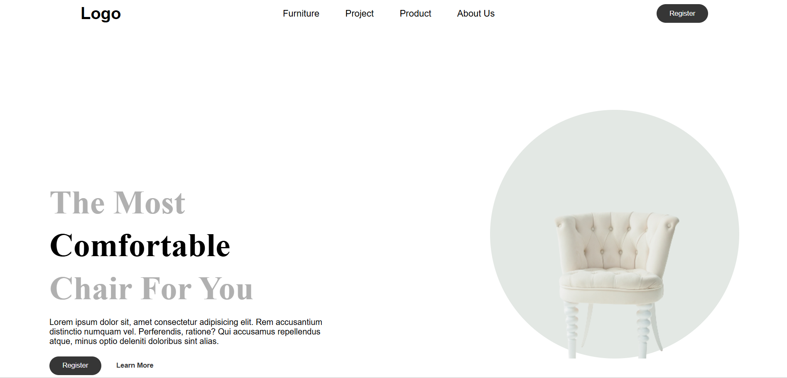
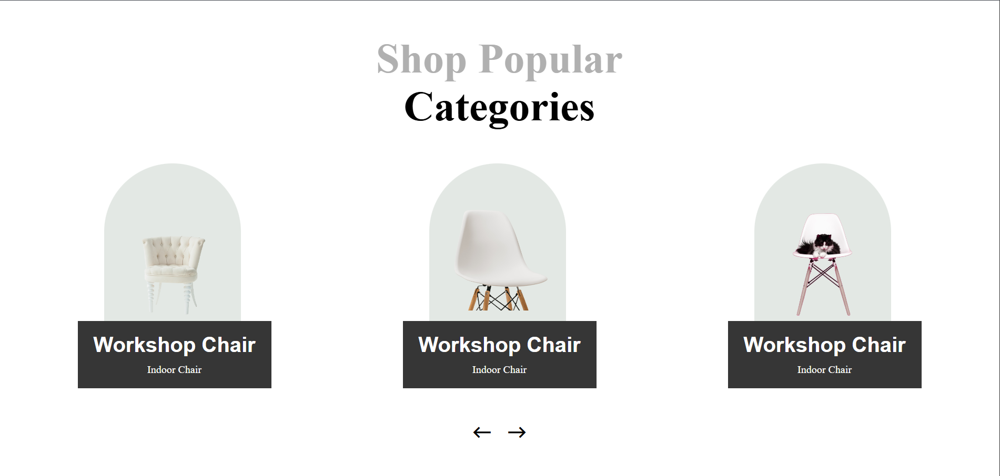
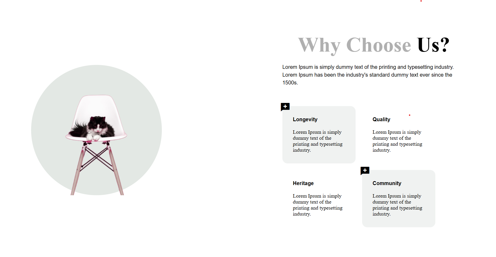
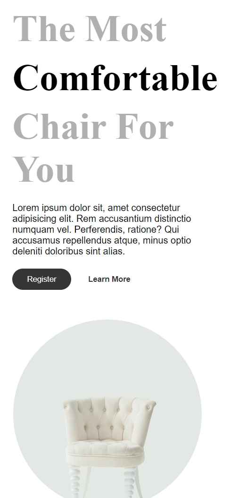
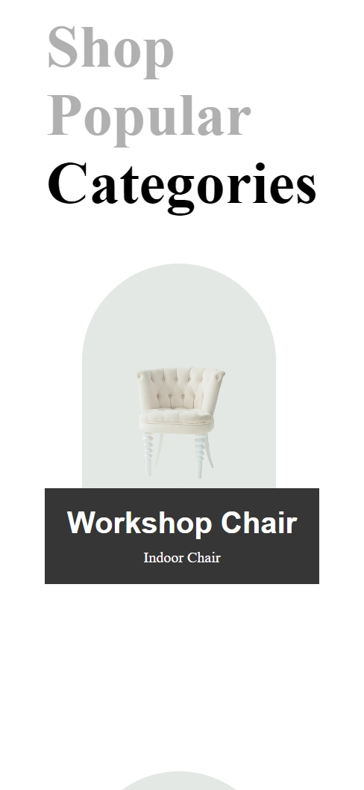
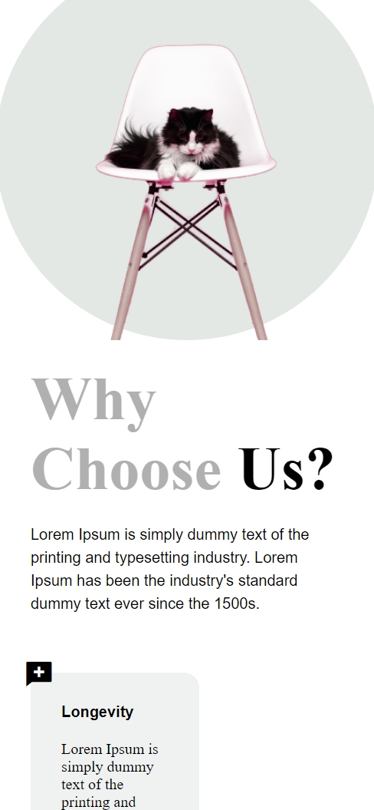

# 🪑 Chair Landing Page

A modern furniture landing page built using **pure HTML and CSS**, focusing on layered UI design, product showcases, and clean typography.

This project explores real-world landing page structure for a furniture brand without using any frameworks or JavaScript.

---

## 🔗 Live Demo

👉 https://vishalloop.github.io/html-css-playground/landing-pages/landing-page-04/
---

## 📸 Preview

### 🖥️ Desktop View

### 📱 Mobile View

---

## 🎯 Purpose of This Project

This landing page was created to:
- Practice **multi-section landing page layout**
- Build **layered card-based UI components**
- Improve **visual hierarchy and spacing**
- Design realistic **product & feature sections**
- Strengthen responsive layout skills using Flexbox

This project is part of my **HTML & CSS playground**, where I learn frontend fundamentals by building real UI designs.

---

## 🛠️ Tech Stack Used

- **HTML5**
- **CSS3**
- Google Fonts
- Remix Icons

> No JavaScript, no frameworks — focused entirely on core frontend fundamentals.

---

## ✨ Features

- ✅ Hero section with CTA and product stats
- ✅ Layered product category cards
- ✅ “Why Choose Us” feature section
- ✅ Feature highlights with icons
- ✅ Clean typography and spacing
- ✅ Responsive navigation (menu icon on smaller screens)
- ✅ Fully responsive layout for desktop, tablet, and mobile

---

## 📱 Responsiveness

- Navigation adapts below **1000px**
- Sections stack cleanly on smaller screens
- Cards and images scale proportionally
- Layout remains readable and balanced across breakpoints

---

## 📂 Folder Structure

landing-page-04/
│
├── index.html
├── style.css
├── images/
│ └── assets used in UI
├── screenshots/
│ ├── desktop_1.png
│ ├── desktop_2.png
│ ├── desktop_3.png
│ ├── mobile_1.png
│ ├── mobile_2.png
│ └── mobile_3.png
└── README.md

---

## 🧠 What I Learned

- Designing **layered UI elements** using CSS
- Structuring complex landing pages
- Using Flexbox for alignment and spacing
- Managing large sections without breaking responsiveness
- Improving component reuse and consistency
- Organizing frontend projects for GitHub presentation

---

## 🚀 Possible Improvements

- Add JavaScript for navigation and sliders
- Improve accessibility (semantic HTML, contrast)
- Add animations and micro-interactions
- Optimize images for better performance
- Convert this layout into a React-based UI

---

## 👨‍💻 Author

**Vishal Raj**  
Frontend Developer — learning by building 🚀

> This project is part of my HTML & CSS playground repository, showcasing my continuous growth through hands-on practice.

---

⭐ If you found this project interesting, feel free to explore the repository and follow my journey.
