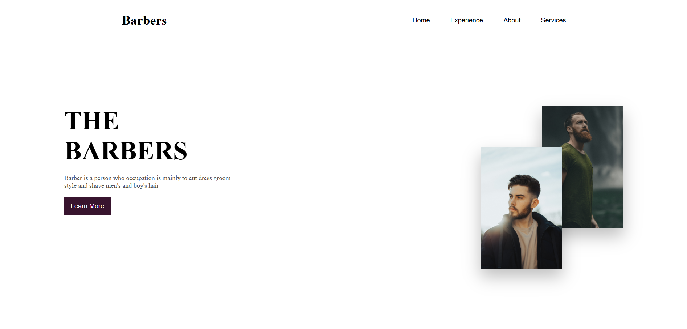
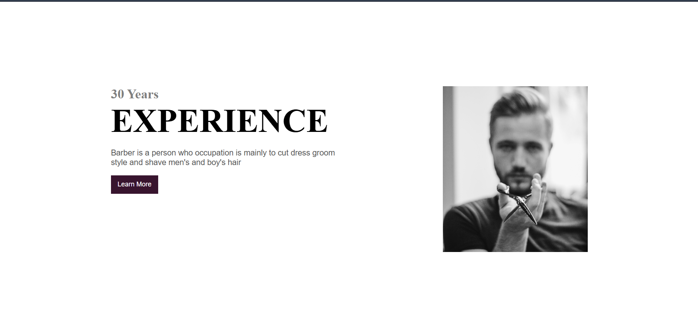
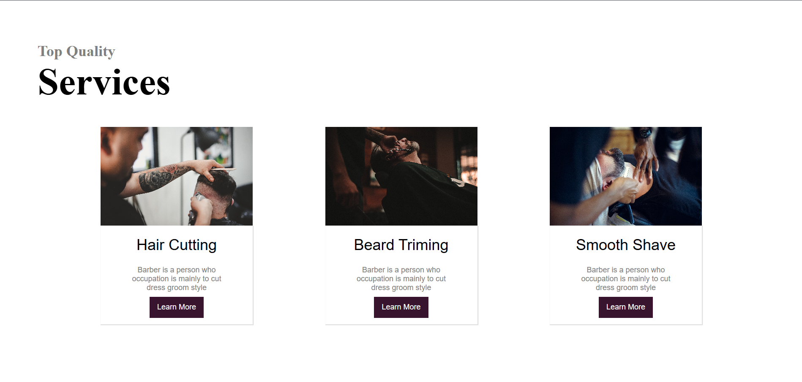
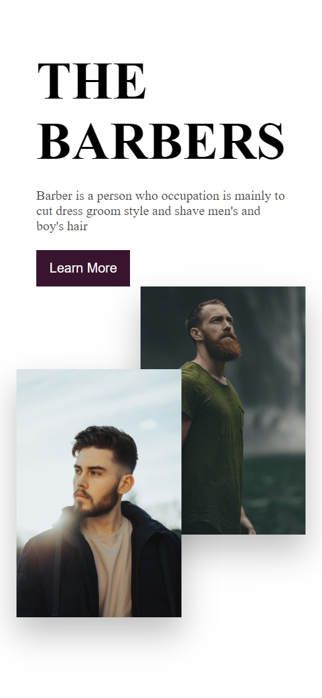
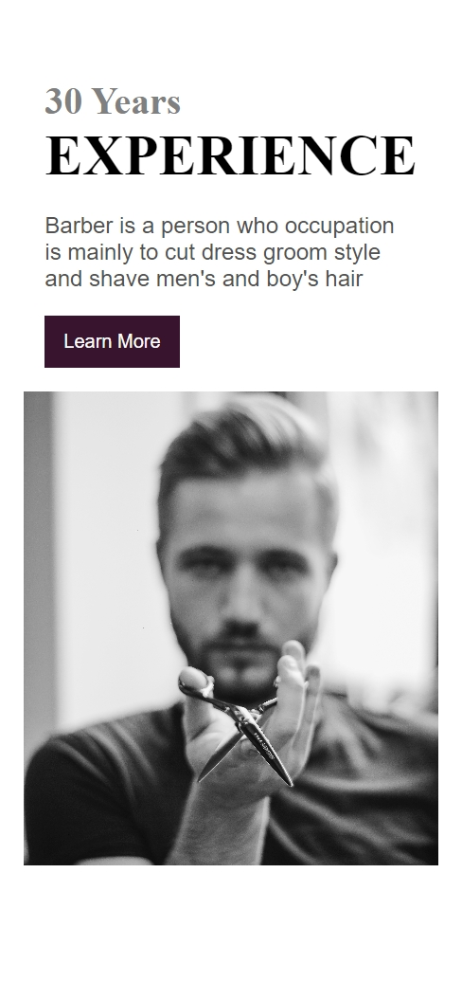
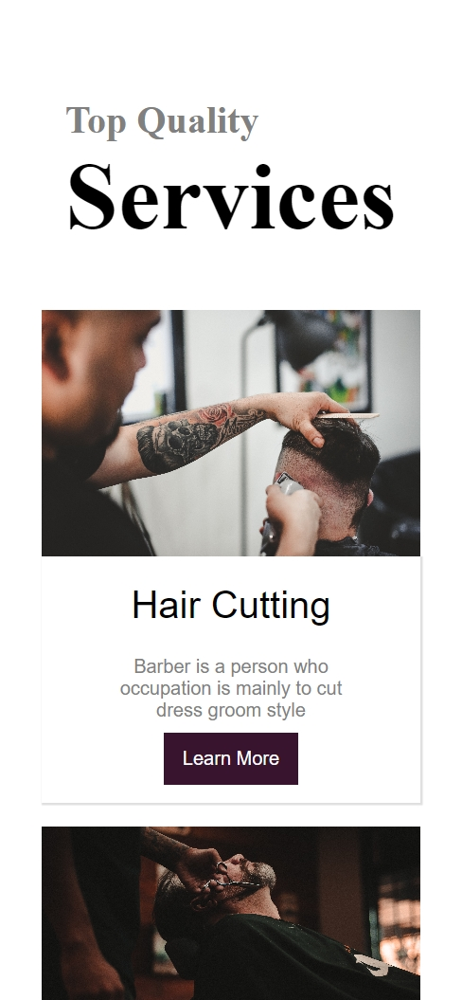

# 💈 Barber Landing Page

A modern and bold landing page for a barber brand, built using **pure HTML and CSS**.  
This project focuses on visual storytelling, layered imagery, strong typography, and responsive layout design without using any frameworks or JavaScript.

---

## 🔗 Live Demo

👉 https://vishalloop.github.io/html-css-playground/landing-pages/landing-page-05/

---

## 📸 Preview

### 🖥️ Desktop View

### 📱 Mobile View

---

## 🎯 Purpose of This Project

This landing page was created to:
- Practice **brand-focused landing page design**
- Work with **layered image compositions**
- Improve **visual hierarchy and typography**
- Design service-based sections and cards
- Strengthen responsive layout skills using Flexbox

This project is part of my **HTML & CSS playground**, where I learn frontend fundamentals by building real-world UI designs.

---

## 🛠️ Tech Stack Used

- **HTML5**
- **CSS3**
- Remix Icons

> No JavaScript or frameworks — focused entirely on core frontend fundamentals.

---

## ✨ Features

- ✅ Bold hero section with layered images
- ✅ Experience highlight section
- ✅ “Meet Our Hero” profile section
- ✅ Services cards with call-to-action buttons
- ✅ Clean footer with navigation links
- ✅ Responsive navigation with mobile menu icon
- ✅ Fully responsive layout for desktop and mobile

---

## 📱 Responsiveness

- Navigation collapses below **700px**
- Sections stack cleanly on smaller screens
- Images resize while maintaining aspect ratio
- Typography scales for better readability on mobile

---

## 📂 Folder Structure

landing-page-05/
│
├── index.html
├── style.css
├── images/
│ └── assets used in UI
├── screenshots/
│ ├── desktop_1.png
│ ├── desktop_2.png
│ ├── desktop_3.png
│ ├── mobile_1.png
│ ├── mobile_2.png
│ └── mobile_3.png
└── README.md

---

## 🧠 What I Learned

- Designing **service-based landing pages**
- Creating layered image effects using CSS
- Managing spacing and layout across sections
- Writing responsive CSS with multiple breakpoints
- Improving UI consistency and structure
- Organizing frontend projects professionally on GitHub

---

## 🚀 Possible Improvements

- Add JavaScript for menu interactions
- Improve accessibility (semantic HTML, contrast)
- Add animations and transitions
- Optimize images for performance
- Convert this layout into a React component

---

## 👨‍💻 Author

**Vishal Raj**  
Frontend Developer — learning by building 🚀

> This project is part of my HTML & CSS playground repository, documenting my continuous growth through hands-on practice.

---

⭐ If you liked this project, feel free to explore the repository and follow my journey.
