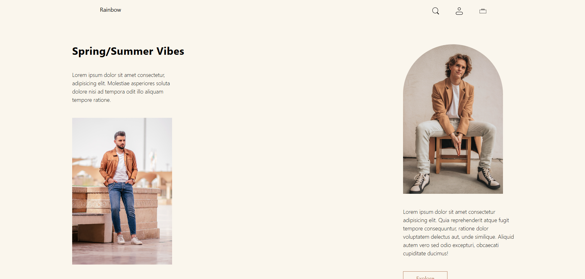
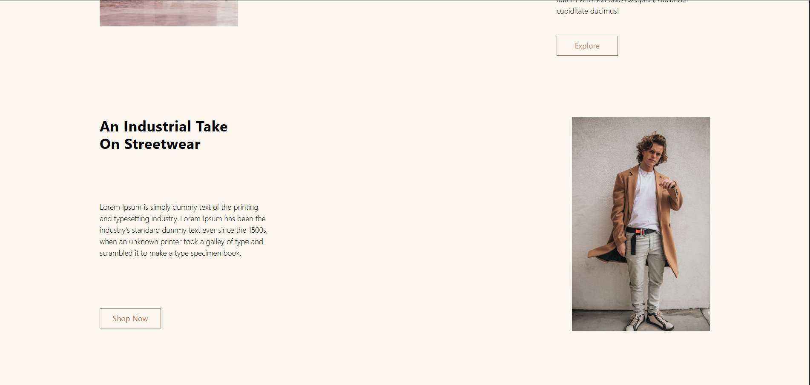
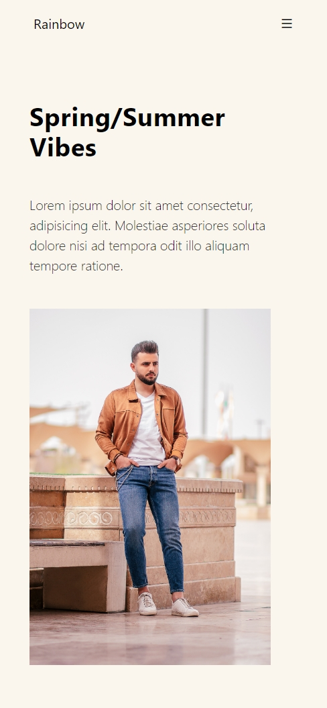
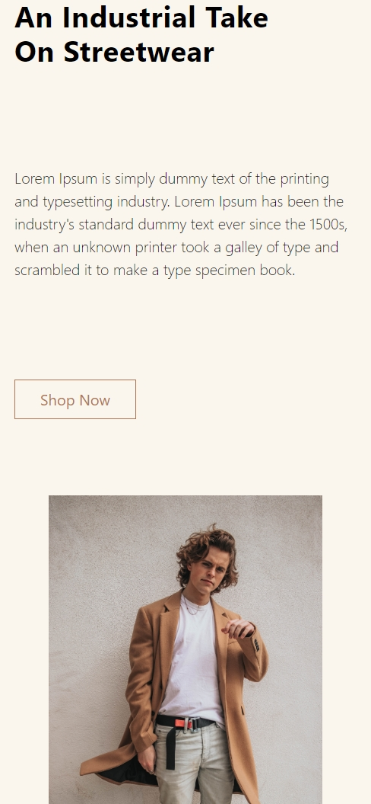

# 🌈 Rainbow — Clothing Brand Landing Page

A clean, minimal **responsive landing page** built using **HTML + Tailwind CSS**.  
This project focuses on layout clarity, spacing, typography, and modern UI composition using utility-first styling.

---

## ✨ Overview

**Rainbow** is a fashion-oriented landing page concept designed to showcase:
- seasonal collections
- editorial-style sections
- product storytelling through layout and imagery

Built with **Tailwind CSS (via npm)**, the project demonstrates how quickly and efficiently modern UIs can be created without writing custom CSS from scratch.

---

## 🛠️ Tech Stack

- **HTML5**
- **Tailwind CSS**
- **Remix Icon**
- **Responsive Design (Mobile → Desktop)**

---

## 📁 Project Structure

tailwind-landing-page/
│
├── images/
│ ├── svg/
│ └── *.jpg
│
├── screenshots/
│ ├── desktop_1.png
│ ├── desktop_2.png
│ ├── mobile_1.png
│ └── mobile_2.png
│
├── src/
│ ├── input.css
│ └── output.css
│
├── index.html
├── package.json
├── package-lock.json
└── .gitignore


---

## 📸 Screenshots

### 🖥️ Desktop View
<p align="center">
  
  <br /><br />
  
</p>

### 📱 Mobile View
<p align="center">
  
  &nbsp;&nbsp;
  
</p>

---

## 🚀 Live Preview

🔗 **Live Site:**  
https://vishalloop.github.io/html-css-playground/tailwind-landing-pages/landing-page-01/

> _(Hosted using GitHub Pages with precompiled Tailwind CSS output)_

---

## ⚙️ How to Run Locally

```bash
npm install
npm run build

