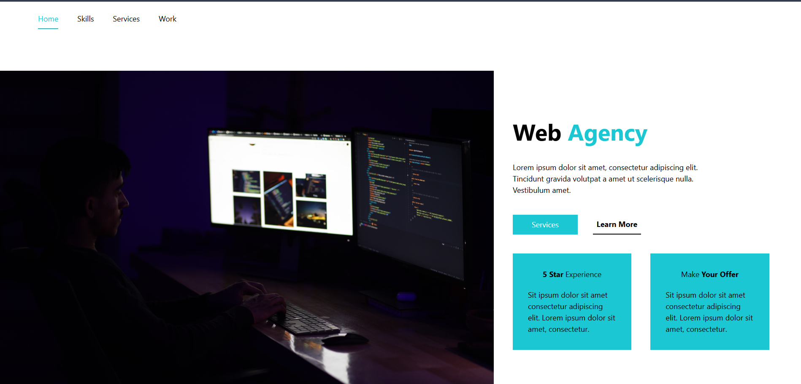
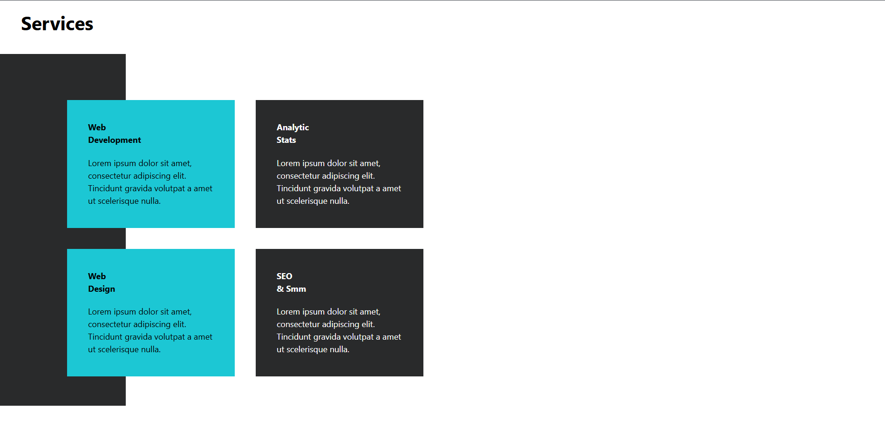
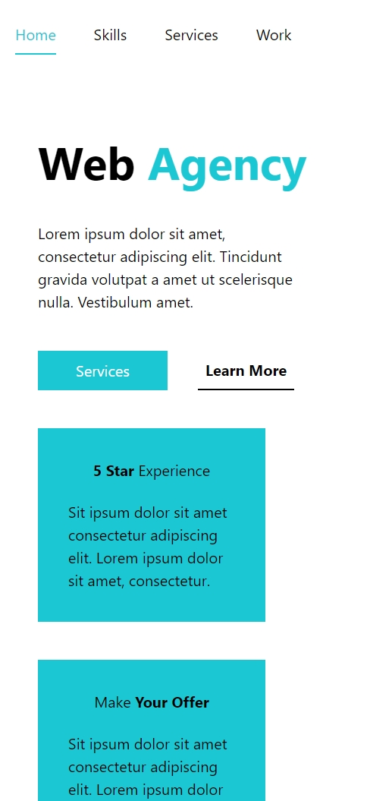
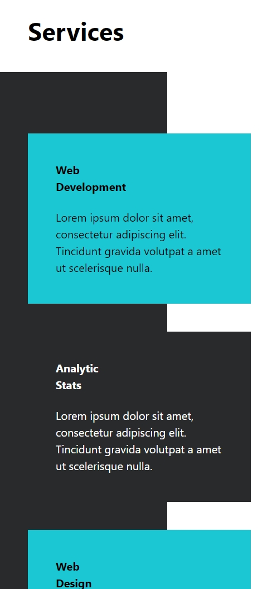

# Loops Studio – Web Agency Landing Page (Tailwind CSS)

A modern, responsive **Web Agency landing page** built using **Tailwind CSS**.  
This project focuses on clean layout composition, utility-first styling, and responsive design without relying on JavaScript.

---

## ✨ Overview

**Loops Studio** is a concept landing page for a creative web agency.  
The goal of this project was to practice and demonstrate:

- Utility-first CSS using **Tailwind**
- Responsive layouts across screen sizes
- Section-based page architecture
- Clean visual hierarchy with minimal custom CSS

---

## 🧠 What This Project Showcases

- ✅ Pure **HTML + Tailwind CSS**
- ✅ Fully responsive design (mobile → desktop → 2XL screens)
- ✅ Flexbox-based layouts
- ✅ Reusable utility patterns
- ✅ Clean spacing, typography, and color consistency
- ❌ No JavaScript (intentional)

---

## 📐 Sections Included

- Navigation bar
- Hero section (agency intro)
- Skills section
- Services showcase
- Recent projects gallery
- Footer with structured links

---

## 🛠 Tech Stack

- **HTML5**
- **Tailwind CSS**
- No frameworks, no JavaScript

---

## 📂 Project Structure

loops-studio/
├── images/
│ ├── hero.jpg
│ ├── section-two.jpg
│ └── project images...
│
├── screenshots/
│ ├── desktop_1.png
│ ├── desktop_2.png
│ ├── mobile_1.png
│ └── mobile_2.png
│
├── src/
│ ├── input.css
│ └── output.css
│
├── index.html
├── package.json
└── package-lock.json


---

## 🖼 Screenshots

### Desktop Preview
<p align="center">
  
</p>
<p align="center">
  
</p>

### Mobile Preview
<p align="center">
  
</p>
<p align="center">
  
</p>

---

## 🚀 Live Preview

> **Live Demo:**  
👉 https://vishalloop.github.io/html-css-playground/tailwind_landing_pages/landing-page-02/

*(Hosted using GitHub Pages with precompiled Tailwind CSS)*

---

## 📦 How to Run Locally

1. Clone the repository
```bash
git clone https://github.com/vishalloop/html-css-playground.git

2. Navigate to the project folder
```bash
cd tailwind_landing_pages/loops-studio

3. Install dependencies
```bash
npm install

4. Build Tailwind CSS
```bash
npm run build

5. Open index.html in your browser
```bash
🎯 Learning Outcome

Improved confidence with Tailwind utility composition

Better understanding of responsive design patterns

Structuring large layouts without custom CSS

Designing production-ready landing pages efficiently

🤝 Contribution

This project is open-source and open for contributions.
Feel free to improve layouts, accessibility, or extend components.

👤 Author

Vishal Raj
Frontend Developer | UI Enthusiast
GitHub: https://github.com/vishalloop

⭐ If you liked this project, consider starring the repository!