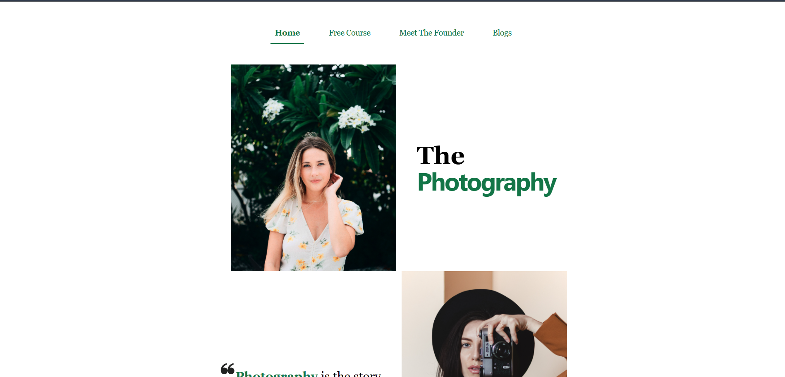
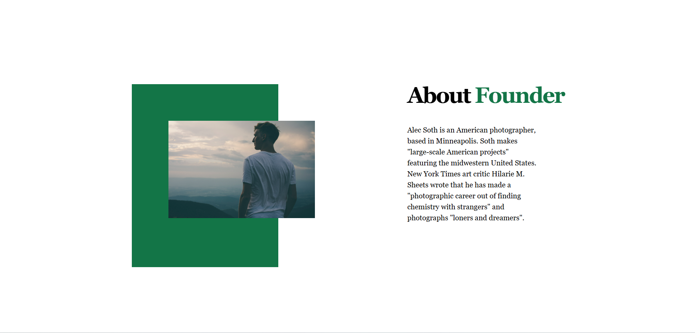
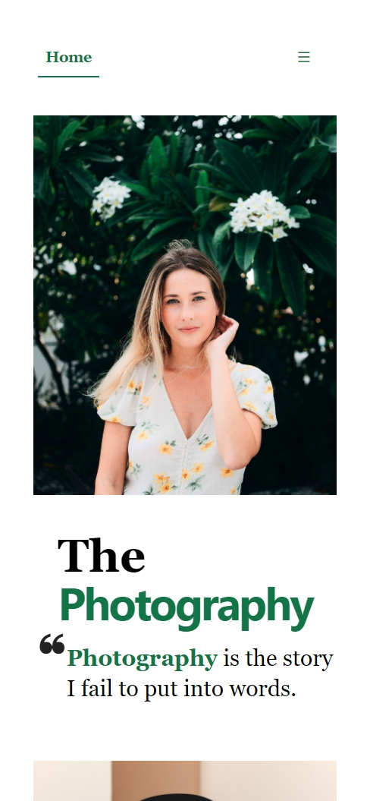
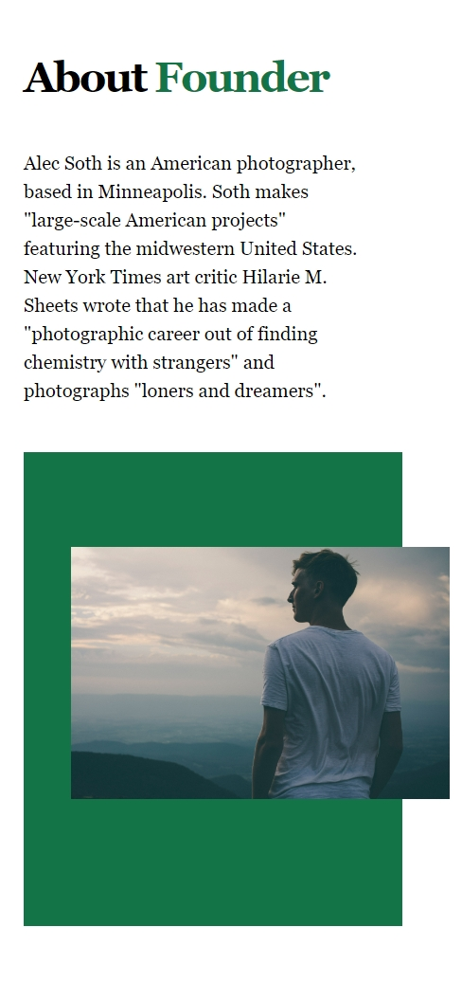

# Photography – Minimal Landing Page

A visually focused **Photography landing page** built using **HTML and Tailwind CSS**, emphasizing typography, imagery, and spacing over heavy interactions.

This project explores how strong visual storytelling alone can carry a design.

---

## ✨ Overview

This landing page is designed around the idea that **photography speaks louder than words**.  
The layout relies on large images, serif typography, negative space, and subtle color accents to create a calm, editorial-style experience.

No JavaScript is used — the entire UI is built using **pure HTML + Tailwind CSS**.

---

## 🎯 Key Highlights

- Typography-driven design
- Image-first layout
- Editorial / magazine-style sections
- Fully responsive (mobile → desktop)
- Clean spacing and composition
- Zero JavaScript (intentional)

---

## 🛠 Tech Stack

- **HTML5**
- **Tailwind CSS**
- **Node.js** (for Tailwind build process)

---

## 📂 Project Structure

photography/
├── images/
│ ├── hero & section images
│ └── project gallery images
│
├── screenshots/
│ ├── desktop_1.png
│ ├── desktop_2.png
│ ├── mobile_1.png
│ └── mobile_2.png
│
├── src/
│ ├── input.css
│ └── output.css
│
├── index.html
├── package.json
└── package-lock.json


---

## 🖼 Screenshots

### Desktop Preview
<p align="center">
  
</p>

<p align="center">
  
</p>

### Mobile Preview
<p align="center">
  
</p>

<p align="center">
  
</p>

---

## 🚀 Live Preview

👉 **Live Demo:**  
https://vishalloop.github.io/html-css-playground/tailwind-landing-pages/landing-page-03/

*(Hosted using pre-compiled Tailwind CSS)*

---

## ▶️ Run Locally

1. Clone the repository
```bash
git clone https://github.com/vishalloop/html-css-playground.git

2. Navigate to the project folder

cd html-css-playground/tailwind_landing_pages/photography

3. Install dependencies

npm install


4. Build Tailwind CSS

npm run build


5. Open index.html in your browser

🧠 What I Focused On

Using typography as a design element

Letting images lead the layout

Minimal color palette for elegance

Responsive layout without media-query overload

Keeping the UI calm and distraction-free

🤝 Contributions

This project is open-source and open for contributions.
Feel free to improve accessibility, layout refinements, or typography choices.

👤 Author

Vishal Raj
Frontend Developer | UI & CSS-focused Builder

GitHub: https://github.com/vishalloop

⭐ If you like this project, consider starring the repository!